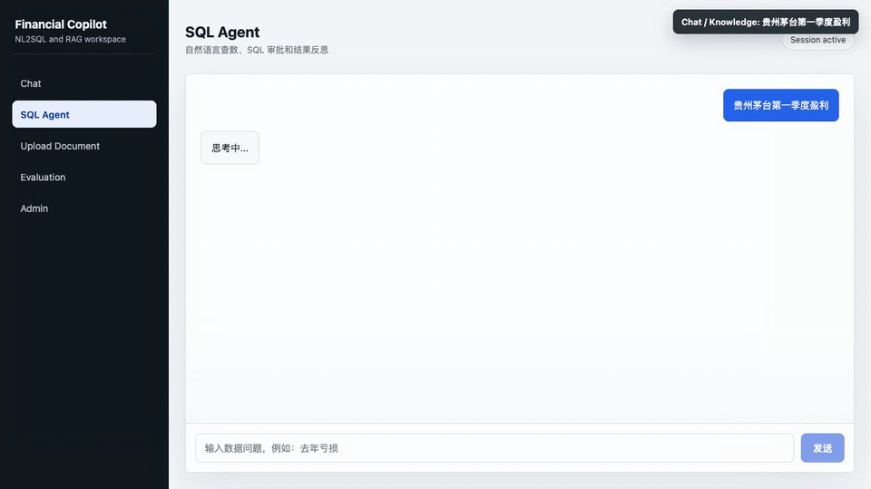
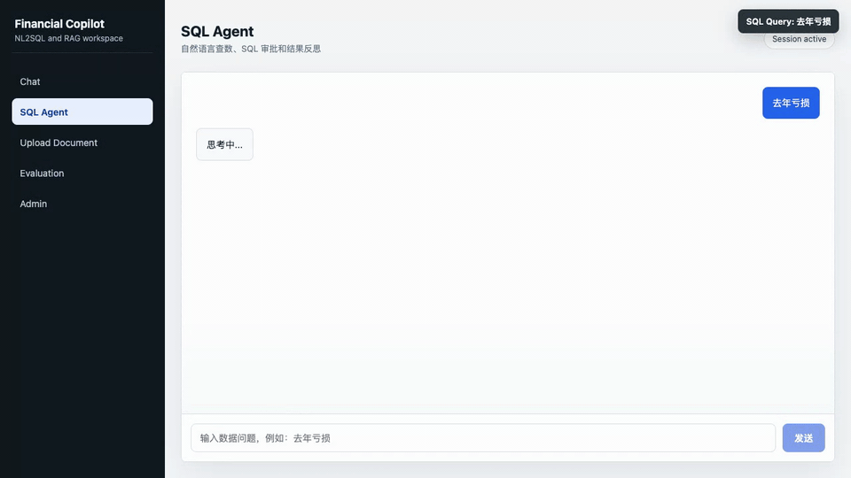
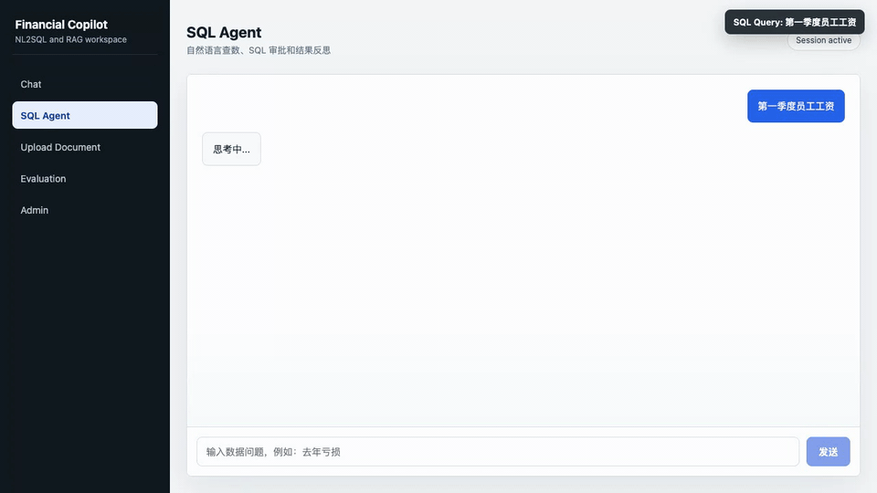
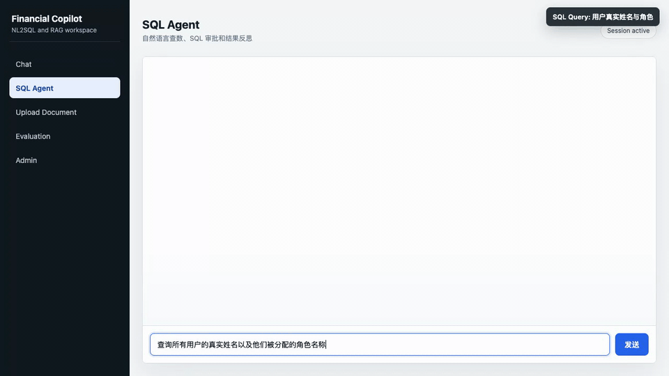
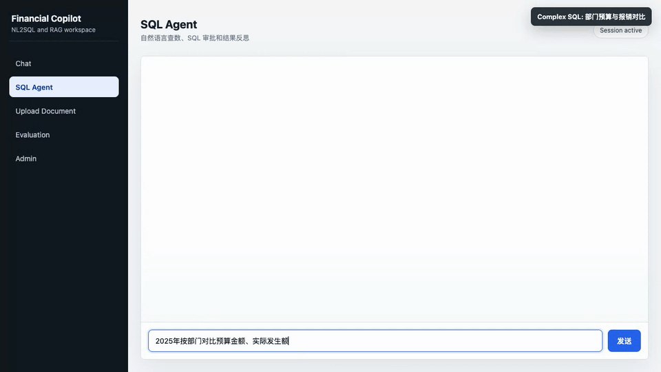
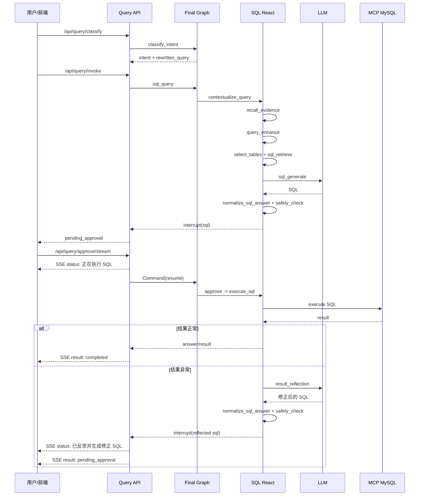

# Financial Copilot Platform

基于 **LangChain + LangGraph** 构建的财务 Copilot 平台，提供自然语言查数据、SQL 自动生成与执行、异常归因、资金核对、审计追踪等核心能力。

## 核心特性

- **自然语言查数据**：自然语言 → SQL → 人工审批 → 执行，含 SQL 安全分析 + 自动纠错重试 + 自动补表
- **多场景意图路由**：意图分类 + 查询重写合并为一次 LLM 调用，自动路由到 SQL/RAG/闲聊
- **可配置意图规则**：常见路由规则存储在 MySQL，通过 Admin 页面维护；规则引擎与 LLM 并行运行，最终仲裁意图
- **统一语义模型**：`t_semantic_model` 表存储字段级业务映射（业务名/同义词/描述）+ 技术 schema（类型/注释/PK/FK），binlog 增量自动同步
- **表关系自动发现**：从 `information_schema.key_column_usage` + 逻辑外键自动提取 JOIN 关系
- **混合检索 RAG**：向量（Milvus）+ BM25（ES）+ RRF 融合 + Cross-Encoder 重排序
- **业务知识 + 智能体知识**：公式/术语定义 + SQL few-shot 示例，并行检索注入 prompt
- **查询增强**：用业务知识翻译术语（如 GMV → 已支付订单总额），提高检索命中率
- **Human-in-the-Loop 审批**：SQL 执行前人工确认，支持修改意见回退重生成
- **三级记忆系统**：工作记忆 + 摘要记忆 + 知识记忆（实体/事实/偏好）
- **SFT 扩展预留**：保留 prompt/completion 采集、教师标注、JSONL 导出模块，默认未接入在线链路
- **多模型支持**：Ark（豆包）、OpenAI、DeepSeek、通义千问、Gemini

## 功能演示（6 个端到端案例）

以下 GIF 均为本地 Web UI 录制，覆盖 Chat/Knowledge 路由、SQL 生成与审批执行、多轮追问、管理表关联查询和多表聚合查询 6 条典型案例。

### Chat / Knowledge：外部公开知识路由

在 SQL Agent 入口提问“茅台第一季度盈利”，系统识别为 Chat/Knowledge，不查询本公司数据库。



### SQL Query：去年亏损

提问“去年亏损”，系统识别为结构化数据查询，生成 SQL，经人工审批后执行并返回结果。



### 多轮追问：亏损多少

先问“去年亏损”，再追问“亏损多少”，系统会沿用上一轮 SQL 口径完成多轮 NL2SQL 追问。


### SQL Query：第一季度员工工资

提问“2026年第一季度按月统计应付职工薪酬借方和贷方金额”，系统完成意图识别、生成 SQL、审批执行，并返回按期间聚合的工资相关结果。



### SQL Query：用户与角色管理表查询

提问“查询所有用户的真实姓名以及他们被分配的角色名称”，系统命中用户、角色和用户角色绑定等管理类表语义，完成管理表关联 SQL 查询。



### Complex SQL：部门预算与报销对比

提问“2025年按部门对比预算金额、实际发生额和已审批报销金额”，系统会召回预算、成本中心、费用报销等多表语义，生成待审批 SQL，并在确认后返回按部门聚合的对比结果。



## 架构概览

```
┌─────────────────────────────────────────────────┐
│  API 层 (FastAPI)                                │
│  路由、SSE 流式、请求校验                          │
├─────────────────────────────────────────────────┤
│  Flow 编排层 (LangGraph)                         │
│  RAG Chat / SQL React / Analyst / Final Graph    │
├─────────────────────────────────────────────────┤
│  能力层                                          │
│  Model（LLM 工厂） / RAG（检索管线） / Tool（工具）│
├─────────────────────────────────────────────────┤
│  基础设施层                                       │
│  Config / Storage（Redis） / Algorithm（BM25/RRF）│
└─────────────────────────────────────────────────┘
```

## 项目结构

```
financial-copilot-platform/
├── pyproject.toml                  # 项目配置 + 依赖
├── .env.example                    # 环境变量模板
├── docker-compose.yaml             # 基础设施（Milvus、ES、Redis）
│
├── agents/                         # 主包
│   ├── main.py                     # 入口
│   ├── config/                     # 配置层
│   │   └── settings.py             # Pydantic Settings
│   │
│   ├── api/                        # API 层
│   │   ├── app.py                  # FastAPI 应用
│   │   ├── sse.py                  # SSE 流式响应
│   │   └── routers/                # 路由
│   │       ├── chat.py             # Chat 测试
│   │       ├── rag.py              # RAG 对话
│   │       ├── query.py            # 主调度（支持中断/恢复）
│   │       ├── document.py         # 文档上传
│   │       └── admin.py            # 语义模型 + 业务知识 CRUD
│   │
│   ├── flow/                       # LangGraph 图编排
│   │   ├── state.py                # 共享状态定义
│   │   ├── rag_chat.py             # RAG Chat 图
│   │   ├── sql_react.py            # SQL React 图（含 Human-in-the-Loop）
│   │   ├── analyst.py              # 数据分析图
│   │   └── dispatcher.py           # 意图调度图
│   │
│   ├── init/                       # 系统初始化
│   │   └── schema_sync.py          # t_semantic_model 自动同步（binlog + 轮询）
│   │
│   ├── model/                      # 模型抽象层
│   │   ├── chat_model.py           # Chat Model 工厂
│   │   ├── embedding_model.py      # Embedding Model 工厂
│   │   ├── format_tool.py          # 结构化输出工具
│   │   └── providers/              # 各提供商实现
│   │       ├── ark.py              # 火山引擎 Ark（豆包）
│   │       ├── openai.py           # OpenAI
│   │       ├── deepseek.py         # DeepSeek
│   │       ├── qwen.py             # 通义千问
│   │       └── gemini.py           # Google Gemini
│   │
│   ├── rag/                        # RAG 管线
│   │   ├── indexing.py             # 文档索引（Loader → Splitter → Store）
│   │   ├── retriever.py            # 混合检索（Milvus + ES BM25 + RRF）
│   │   ├── domain_summary_builder.py # 基于语义模型生成领域摘要
│   │   ├── parent_retriever.py     # Parent Document RAG
│   │   ├── reranker.py             # Cross-Encoder 重排序
│   │   ├── query_rewrite.py        # 查询重写（指代消解）
│   │   └── schema_indexer.py       # 旧版 mysql_schema 向量索引兼容入口（默认禁用）
│   │
│   ├── tool/                       # 工具层
│   │   ├── registry.py             # 统一 Tool Registry
│   │   ├── memory/                 # 三级记忆系统
│   │   ├── storage/                # 存储层
│   │   │   ├── redis_client.py     # Redis 连接
│   │   │   ├── checkpoint.py       # LangGraph Checkpointer
│   │   │   ├── domain_summary.py   # 领域摘要持久化
│   │   │   ├── intent_rules.py     # 可配置意图规则
│   │   │   └── doc_metadata.py     # 文档元数据（MySQL）
│   │   ├── document/               # 文档处理
│   │   ├── sql_tools/              # SQL 工具
│   │   │   ├── mcp_client.py       # MCP 客户端
│   │   │   ├── execute_tool.py     # @tool: execute_query
│   │   │   ├── schema_tool.py      # @tool: list_tables, describe_table
│   │   │   ├── safety.py           # SQL 安全分析
│   │   │   └── error_codes.py      # 错误码分类 + is_retryable()
│   │   ├── analyst_tools/          # 数据分析
│   │   ├── sft/                    # SFT 扩展预留（默认未启用）
│   │   └── trace/                  # 可观测性
│   │
│   ├── algorithm/                  # 算法
│   │   ├── bm25.py                 # BM25 实现
│   │   └── rrf.py                  # RRF 融合
│   │
│   └── static/                     # 前端
│       └── index.html              # Chat + SQL Agent + 文档上传 UI
│
├── scripts/                        # 种子数据脚本
│   ├── seed_semantic_model.py      # 语义模型初始化 + information_schema 同步
│   ├── seed_business_knowledge.py  # 业务知识种子 + Milvus/ES 索引
│   ├── seed_agent_knowledge.py     # 智能体知识种子 + Milvus/ES 索引
│   └── seed_financial.py           # 财务测试数据
│
├── tests/                          # 测试
├── docs/                           # 技术文档
│   ├── iterations.md               # 迭代优化记录
│   └── resilience_design.md        # 熔断降级与 Fallback 设计
├── python_langchain_design.md       # 技术设计文档
│
└── data/                           # 数据目录
    ├── business_knowledge_seed.json # 可配置业务知识种子
    └── sft/                        # SFT 导出数据（预留）
```

## 快速开始

### 1. 环境准备

```bash
# Python 3.11+
python -m venv .venv
source .venv/bin/activate
pip install -e .

# 如需链路追踪（CozeLoop）
pip install cozeloop
```

### 2. 启动基础设施

```bash
docker-compose up -d
```

启动以下服务：
| 服务 | 端口 | 说明 |
|------|------|------|
| Milvus | 19530 | 向量数据库 |
| Attu | 8000 | Milvus Web UI |
| Elasticsearch | 9200 | 全文检索 |
| Redis | 6379 | 缓存 + CheckPoint |
| MinIO | 9000/9001 | Milvus 对象存储 |

### 3. 配置环境变量

```bash
cp .env.example .env
# 编辑 .env 填入你的 API Key
```

必须配置的变量：

```bash
# 模型（至少配置一个）
CHAT_MODEL_TYPE=ark
ARK_KEY=your-ark-key
ARK_CHAT_MODEL=doubao-seed-2-0-code-preview-260215

# Embedding
EMBEDDING_MODEL_TYPE=qwen
QWEN_KEY=your-qwen-key
QWEN_EMBEDDING_MODEL=text-embedding-v3

# 向量数据库
MILVUS_ADDR=localhost:19530

# ES
ES_ADDRESS=http://localhost:9200

# Redis
REDIS_ADDR=localhost:6379
```

### 4. 启动服务

```bash
# 方式 1：直接运行
python -m agents.main

# 方式 2：uvicorn
uvicorn agents.api.app:app --host 0.0.0.0 --port 8080 --reload
```

服务启动后访问：

| 页面 | 路径 | 说明 |
|------|------|------|
| Chat UI | http://localhost:8080/ | RAG 对话（Tab 1） |
| SQL Agent | http://localhost:8080/ | 意图路由 + SQL 生成（Tab 2） |
| 文档上传 | http://localhost:8080/ | 上传文档并索引到 RAG（Tab 3） |
| Admin | http://localhost:8080/ | 意图规则 / 语义模型 / 业务知识 / 智能体知识管理（Tab 5） |
| API 文档 | http://localhost:8080/docs | Swagger UI |
| 健康检查 | http://localhost:8080/health | 服务状态 |

## 初始化脚本教程

这些脚本用于把 NL2SQL 需要的“数据、语义、业务口径、SQL 示例”准备好。代码只负责加载和同步，具体业务口径应放在 MySQL 或 seed 配置文件里，不应写在查询逻辑里。

### 推荐顺序

全新环境建议直接执行总入口：

```bash
python -m scripts.seed_all
```

它会按顺序执行：

1. `seed_financial`：创建财务测试业务表并写入样例数据。
2. `seed_semantic_model`：初始化 `t_semantic_model`，同步字段类型、注释、主键、外键和业务映射。
3. `seed_business_knowledge`：把业务术语、公式、同义词写入 `t_business_knowledge`，并索引到 Milvus/ES。
4. `seed_agent_knowledge`：写入 SQL Q&A few-shot 示例，并索引到 Milvus/ES。
5. `seed_intent_rules`：写入可配置意图规则，辅助 LLM 稳定路由。

意图规则表 `t_intent_rule` 由服务启动时自动确保存在。规则内容不写在运行时代码里；需要固化高频路由规则时，可通过 `data/intent_rules_seed.json` 初始化，也可在 Admin 页面新增、编辑、删除。规则还支持可选 `rewrite_template`，用于把“第一季度毛利率”这类省略主体的问题补齐成“公司第一季度毛利率”。

### 脚本说明

| 脚本 | 为什么执行 | 写入/影响 | 什么时候执行 |
|------|------------|-----------|--------------|
| `scripts.seed_financial` | 准备本地演示和测试数据，否则 SQL Agent 没有业务表可查 | 创建 `t_account`、`t_journal_entry`、`t_journal_item` 等财务表和样例数据；包含可重复刷新的上一年度已过账亏损场景 | 首次搭建、重置测试库、验证“去年亏损/亏损多少” |
| `scripts.seed_semantic_model` | 让 NL2SQL 理解字段业务含义，而不只看到物理字段名 | 创建/更新 `t_semantic_model`，从 `information_schema` 同步技术 schema，并写入业务名/同义词/描述 | 表结构变更后、首次搭建 |
| `scripts.seed_business_knowledge` | 提供业务术语、公式、同义词，例如“亏损”对应某个业务口径 | 创建/更新 `t_business_knowledge`，并写入 Milvus/ES 检索索引 | 业务口径变更后、首次搭建 |
| `scripts.seed_agent_knowledge` | 提供 SQL few-shot 示例，帮助 LLM 学习项目内常见 SQL 写法 | 创建/更新 `t_agent_knowledge`，并写入 Milvus/ES 检索索引 | 新增高质量 SQL 示例后 |
| `scripts.seed_intent_rules` | 提供高频、确定性强的路由规则，和 LLM 意图识别并行后仲裁 | 创建/更新 `t_intent_rule`；规则数据来自 `data/intent_rules_seed.json` 或 Admin 页面 | 首次搭建、路由规则调整后 |
| `scripts.seed_all` | 一键完成完整初始化，减少漏跑脚本 | 顺序执行以上脚本；schema 只进入 MySQL/Redis，不再写入 Milvus/ES | 全新环境优先使用 |
| `scripts.cleanup_schema_indexes` | 清理旧版本遗留的 schema 向量索引 | 删除 Milvus/ES 中 `source=mysql_schema` 的历史记录 | 升级到 MySQL/Redis schema 检索后执行一次 |

### 单独执行

```bash
# 1. 只创建财务测试表和样例数据
python -m scripts.seed_financial

# 2. 只同步语义模型
python -m scripts.seed_semantic_model

# 3. 只同步业务知识
python -m scripts.seed_business_knowledge

# 4. 只同步 SQL few-shot 示例
python -m scripts.seed_agent_knowledge

# 5. 只同步可配置意图规则
python -m scripts.seed_intent_rules

# 6. 清理旧 schema 向量索引（升级后执行一次）
python -m scripts.cleanup_schema_indexes
```

`scripts.seed_financial` 会额外写入一组 `LOSS-YYYY-*` 凭证，用于稳定验证“去年亏损”“亏损多少”等 NL2SQL 场景。脚本每次执行都会先清理同年度旧的 `LOSS-YYYY-*` 凭证，再重新插入上一年度 12 个月的已过账收入、成本、费用分录，避免重复累加。该数据只用于测试库造数，不参与运行时 SQL 生成逻辑。

### 评测数据与报告

```bash
# 从 t_semantic_model 生成 schema 评测数据集
python -m agents.eval.cli generate --num-per-table 3 --output data/eval/eval_dataset.jsonl

# 运行召回评测并生成报告
python -m agents.eval.cli run --dataset data/eval/eval_dataset.jsonl --output data/eval/eval_report.json

# 首次准备 NL2SQL 端到端回放样本模板
python -m agents.eval.cli run-nl2sql --dataset data/eval/nl2sql_cases.jsonl --init-template

# 填写真实 generated_sql / actual_result / expected_result 后运行端到端结果评测
python -m agents.eval.cli run-nl2sql --dataset data/eval/nl2sql_cases.jsonl --output data/eval/nl2sql_eval_report.json

# 首次准备在线 NL2SQL 回放样本模板
python -m agents.eval.cli run-online-nl2sql --dataset data/eval/online_nl2sql_cases.jsonl --init-template

# 真实调用 Agent，到 SQL 审批中断为止
python -m agents.eval.cli run-online-nl2sql --dataset data/eval/online_nl2sql_cases.jsonl --output data/eval/online_nl2sql_eval_report.json

# 测试库中自动审批并执行 SQL
python -m agents.eval.cli run-online-nl2sql --dataset data/eval/online_nl2sql_cases.jsonl --output data/eval/online_nl2sql_eval_report.json --auto-approve-sql
```

这些命令的区别：

| 命令 | 作用 | 输出 |
|------|------|------|
| `generate` | 基于 MySQL `t_semantic_model` 和 LLM 生成自然语言 query，并标注标准相关表 `relevant_doc_ids` | `eval_dataset.jsonl` |
| `run` | 对数据集里的 query 执行召回策略，把实际召回表和标准相关表对比，计算 Accuracy、Recall、MRR、NDCG、延迟等指标 | `eval_report.json` |
| `run-nl2sql` | 对已有 NL2SQL 回放样本计算 SQL 有效率、执行成功率、结果匹配率、延迟和首字延迟 | `nl2sql_eval_report.json` |
| `run-online-nl2sql` | 真实调用线上 Agent 回放自然语言 query，可停在审批中断，也可自动审批后执行 SQL | `online_nl2sql_eval_report.json` |

`run` 默认评测：

- `schema_lexical`：本地 schema metadata 词法召回基线。
- `schema_table_name`：只看表名的对照组。
- `business_knowledge_recall`：业务知识召回，只有数据集带 `relevant_business_doc_ids` 时计算。
- `agent_knowledge_recall`：SQL few-shot 召回，只有数据集带 `relevant_agent_doc_ids` 时计算。

线上选表前置链路 `preselect_pipeline` 会执行 `recall_evidence -> query_enhance -> select_tables`，可能调用外部 LLM。需要评测真实线上链路时显式开启：

```bash
python -m agents.eval.cli run \
  --dataset data/eval/eval_dataset.jsonl \
  --output data/eval/eval_report.json \
  --include-online-pipeline
```

最近一次全量线上预选链路评测（`eval_dataset.jsonl`，45 条，2026-05-13）：

| 策略 | 样本数 | MRR | Accuracy@5 | Recall@5 | NDCG@5 | P50/P95 延迟 |
|------|------:|----:|-----------:|---------:|-------:|-------------:|
| `schema_lexical` | 45 | 96.67% | 77.78% | 90.63% | 90.03% | 0.0 / 0.1 ms |
| `preselect_pipeline` | 45 | 96.67% | 88.89% | 94.07% | 94.13% | 7426.8 / 10541.4 ms |

管理表专项线上评测（12 条）中，`preselect_pipeline` 的 `Recall@5` 和 `MRR` 均为 `100%`；该专项指标不等同于全量业务指标。

默认不再加载旧版 Milvus/ES schema 文档检索和 CrossEncoder reranker。完整原理、指标解释和报告格式见 [评测体系设计](docs/evaluation_design.md)。

评测集默认排除 `domain_summary`、`t_semantic_model` 等系统内部表，避免把 Agent 元数据表误当成业务查询目标。

`generate` 默认还会基于本地 `t_business_knowledge` 和 `t_agent_knowledge` 补充可选标注字段：

- `relevant_business_doc_ids`
- `relevant_agent_doc_ids`

这一步是本地字符串/词法匹配，不调用 LLM。如需关闭：

```bash
python -m agents.eval.cli generate \
  --num-per-table 3 \
  --output data/eval/eval_dataset.jsonl \
  --no-knowledge-labels
```

`run-nl2sql` 不会调用线上 Agent，也不会执行数据库，只评测已记录样本。如果样本文件还不存在，先执行：

```bash
python -m agents.eval.cli run-nl2sql \
  --dataset data/eval/nl2sql_cases.jsonl \
  --init-template
```

然后把模板里的 `generated_sql`、`actual_result`、`expected_result` 替换为真实回放 case。样本格式：

```json
{"query":"去年亏损多少","generated_sql":"SELECT ...;","actual_result":[{"loss_amount":"100.00"}],"expected_result":[{"loss_amount":"100.00"}],"latency_ms":1200,"first_token_latency_ms":350}
```

`run-online-nl2sql` 会调用真实 Agent，适合测试线上链路。默认强制 `intent=sql_query`，避免把意图分类混入 SQL 生成指标；如需完整调度链路，加 `--full-dispatch`。默认不自动审批 SQL，只记录首个审批中断和生成 SQL；如需执行到结果，加 `--auto-approve-sql`，建议只在测试库或只读账号上使用。

### 业务知识配置

默认业务知识来自：

```bash
data/business_knowledge_seed.json
```

这个文件是可配置数据，不是运行逻辑。修改业务术语、公式、同义词后，重新执行：

```bash
python -m scripts.seed_business_knowledge
```

如果不同项目有不同业务口径，不要改 Python 脚本，指定自己的 JSON 文件：

```bash
BUSINESS_KNOWLEDGE_SEED_FILE=/path/to/business_knowledge.json \
  python -m scripts.seed_business_knowledge
```

JSON 格式：

```json
[
  {
    "term": "业务术语",
    "formula": "公式或口径说明",
    "synonyms": "同义词1, 同义词2",
    "related_tables": "t_table_a,t_table_b"
  }
]
```

### 执行前提

- MySQL、Milvus、Elasticsearch 已启动。
- `.env` 里配置了 MySQL、Embedding 模型、Milvus、ES。
- `seed_business_knowledge` 和 `seed_agent_knowledge` 需要 Embedding 配置可用，因为会写向量索引。
- 如果只想先打开前端和 API，可以先启动服务；但 SQL Agent 的业务增强和 few-shot 质量依赖这些 seed 数据。

## API 接口

### Chat 测试

```bash
# 非流式
curl -X POST http://localhost:8080/api/chat/test \
  -H "Content-Type: application/json" \
  -d '{"question": "你好", "history": []}'

# 流式（SSE）
curl -X POST http://localhost:8080/api/chat/test/stream \
  -H "Content-Type: application/json" \
  -d '{"question": "介绍一下自己"}'
```

### RAG 对话

```bash
# 文档索引
curl -X POST http://localhost:8080/api/rag/insert \
  -F "file=@document.pdf"

# RAG 问答
curl -X POST http://localhost:8080/api/rag/ask \
  -H "Content-Type: application/json" \
  -d '{"query": "文档中提到了什么？", "session_id": "user1"}'

# RAG 流式对话
curl -X POST http://localhost:8080/api/rag/chat/stream \
  -H "Content-Type: application/json" \
  -d '{"query": "继续刚才的话题", "session_id": "user1"}'
```

### 主调度（意图路由）

```bash
# 自动分类意图：SQL 查询 vs 普通对话
curl -X POST http://localhost:8080/api/final/invoke \
  -H "Content-Type: application/json" \
  -d '{"query": "查询最近 7 天的订单数量", "session_id": "user1"}'

# 流式（前端默认，含 SQL 审批事件）
curl -X POST http://localhost:8080/api/final/invoke/stream \
  -H "Content-Type: application/json" \
  -d '{"query": "查询最近 7 天的订单数量", "session_id": "user1"}'
```

### 文档上传

```bash
# 上传文档并索引（默认 RAG 模式）
curl -X POST http://localhost:8080/api/document/insert \
  -F "file=@document.pdf"

# 指定 Parent Document RAG 模式
curl -X POST http://localhost:8080/api/document/insert \
  -F "file=@document.pdf" \
  -F "rag_mode=parent"
```

## 核心设计

### 1. LangGraph 图编排

所有业务流程用 **StateGraph** 定义，节点间通过 TypedDict 共享状态：

```python
# 定义状态
class RAGChatState(TypedDict):
    query: str
    docs: list[Document]
    messages: Annotated[list[BaseMessage], add_messages]
    answer: str

# 构建图
graph = StateGraph(RAGChatState)
graph.add_node("retrieve", retrieve)
graph.add_node("chat", chat)
graph.add_edge(START, "retrieve")
graph.add_edge("retrieve", "chat")
graph.add_edge("chat", END)

app = graph.compile()
result = await app.ainvoke({"query": "..."})
```

**优势：**
- 节点自动并行执行（无依赖的节点）
- 原生支持中断/恢复（Human-in-the-Loop）
- 状态流转清晰，可调试

### 2. 混合检索 + 重排序

```
Query → [Milvus(向量), ES(BM25)] → RRF 融合 → Cross-Encoder 重排序 → Top-K
```

- **Milvus**：稠密向量相似度检索
- **Elasticsearch**：BM25 关键词检索（不是向量！）
- **RRF**：Reciprocal Rank Fusion，无需调参
- **Cross-Encoder**：`BAAI/bge-reranker-v2-m3`，精排序

### 3. 分层记忆系统

| 层级 | 存储 | 内容 | 触发方式 |
|------|------|------|----------|
| 短期记忆 | `Session.history` 滑动窗口 | 最近 `MEMORY_SHORT_WINDOW_MESSAGES` 条消息，直接注入意图识别/重写 | 每轮读取时裁剪 |
| 中期记忆 | `Session.summary` | LLM 将旧消息和已有摘要合并后的滚动摘要 | 历史超过 `MEMORY_SUMMARY_MAX_HISTORY_LEN` 后异步压缩 |
| 长期记忆 | Milvus `source=conversation_memory` | 被压缩归档的旧对话，按 `session_id` 隔离 | 压缩成功后写入向量库，后续按当前 query 语义召回 |

**压缩与召回流程：**
1. 每轮完成后保存 Q&A 到 session。
2. 后台 memory manager 判断历史长度，超过阈值时保留最近 `MEMORY_SUMMARY_KEEP_RECENT` 条。
3. 旧消息与已有摘要合并成新的 `Session.summary`。
4. 被归档的旧消息写入 Milvus 长期记忆。
5. 后续查询只携带短期窗口 + 摘要；如果当前 session 有长期记忆，再按 query 召回相关归档片段。

结构化实体、事实、偏好提取模块仍保留为扩展能力，适合后续把稳定用户偏好或业务事实沉淀为更可控的长期记忆。

### 4. SQL 安全分析

```python
checker = SQLSafetyChecker()
report = checker.check("DELETE FROM users WHERE 1=1")
# report.risks = ["DELETE with always-true WHERE"]
# report.is_safe = False
```

检测模式：DROP TABLE、DELETE without WHERE、TRUNCATE、UPDATE with always-true WHERE 等。

### 5. SQL React 图流程

```
contextualize_query → recall_evidence → query_enhance → select_tables → sql_retrieve → check_docs → sql_generate
     (代词消解)         (业务知识+few-shot)  (术语翻译)      (LLM选表)    (MySQL语义模型)              (SQL生成+补表)
     → safety_check → approve → execute_sql
          (安全检查)     (人工审批)     (MCP执行)
```

**核心流程**：
1. **代词消解**：结合对话历史将"他"→"zhangsan01"
2. **证据检索**：并行检索业务知识（公式/术语）+ 智能体知识（SQL 示例），RRF 融合
3. **查询增强**：基于召回到的业务知识 evidence 翻译术语/同义词；业务知识召回支持 MySQL `term/synonyms` 兜底
4. **表选择**：从 MySQL `t_semantic_model` 加载表名+描述，LLM 精选
5. **Schema 加载**：从 `t_semantic_model` 构建含业务映射的 schema 文档
6. **SQL 生成**：含自动补表（最多 3 轮）+ 表关系 JOIN 提示；生成结果经 `normalize_sql_answer()` 清洗/校验
7. **安全检查 + 审批 + 执行**：SQL 安全分析 → 人工审批 → MCP 执行

### 6. 检索数据源分工

当前项目把“结构化元数据”和“非结构化知识”分开存储，避免用向量库承担精确 schema 查询。

| 数据 | 存储位置 | 检索方式 | 使用节点 | 为什么这样查 |
|------|----------|----------|----------|--------------|
| 表名、表注释 | Redis `schema:table_metadata`；miss 后查 MySQL `information_schema.tables` | 精确读取全量候选表，再由 LLM 精选 | `select_tables` | 表名是结构化元数据，要求完整、实时、可解释，不适合靠向量相似度召回 |
| 字段类型、字段注释、PK/FK、业务名、同义词、业务描述 | Redis `schema:semantic_model:<table>`；miss 后查 MySQL `t_semantic_model` | 按已选表精确加载 | `sql_retrieve`、自动补表 | SQL 生成必须拿到准确字段和关系，Redis 降低延迟，MySQL 作为权威来源 |
| 表关系、JOIN 关系 | MySQL `t_semantic_model` 的逻辑外键 + `information_schema.key_column_usage` | 按表名精确查询 | `select_tables`、`sql_generate` | JOIN 条件必须确定，不能依赖向量相似度推断 |
| 业务术语、公式、同义词 | MySQL `t_business_knowledge` + Milvus `source=business_knowledge` + ES `metadata.source=business_knowledge` | Milvus 向量召回 + ES BM25 + RRF；不足时 MySQL term/synonyms 字符匹配兜底 | `recall_evidence`、`query_enhance`、`sql_generate` | 用户表达可能口语化，向量适合语义近似，BM25 适合关键词命中，MySQL 兜底保证配置过的同义词能命中 |
| SQL few-shot 示例 | MySQL `t_agent_knowledge` + Milvus `source=agent_knowledge` + ES `metadata.source=agent_knowledge` | Milvus 向量召回 + ES BM25 + RRF；过滤不含 SQL 的结果 | `recall_evidence`、`sql_generate` | 示例 SQL 是非结构化知识，向量找相似问题，BM25 命中表名/字段名/指标词 |
| 用户上传文档 | Milvus/ES 文档索引 | RAG 检索、重排 | RAG Chat 流程 | 文档内容天然非结构化，适合向量语义召回 + 关键词召回 |
| 会话状态、checkpoint、schema 缓存、领域摘要缓存 | Redis | key-value 精确读取 | API、LangGraph、schema sync | 高频状态数据需要低延迟读写，Redis 作为缓存和会话存储 |
| 实际业务数据 | MySQL 业务表 | LLM 生成 SELECT，经审批后由 MCP MySQL 执行 | `execute_sql` | MySQL 是业务数据权威来源，SQL 执行前必须经过安全检查和人工确认 |

`source=mysql_schema` 的 Milvus/ES 记录是旧版 schema 向量检索遗留数据。当前 NL2SQL 不再读取这些记录，升级后可执行：

```bash
python -m scripts.cleanup_schema_indexes
```

清理后，Milvus/ES 只保留业务知识、SQL few-shot、用户文档等非结构化检索数据；schema 统一由 Redis/MySQL 提供。

**执行后自修正**：
- 执行失败时，`is_retryable()` 判断错误类型，可重试错误进入 `error_analysis → sql_generate`
- 执行成功但结果异常（空集、`NULL`、包装结构中的 `rows: []` 等）进入 `result_reflection`
- `result_reflection` 直接生成修正后的 SQL，然后走 `safety_check → approve → execute_sql`，不再重复进入 `sql_generate`
- 审批恢复使用 SSE 展示“执行中 → 异常检测 → 反思生成修正 SQL → 等待确认”的过程，避免用户误以为重复审批同一条 SQL
- `query` 是稳定输入字段，父图和 SQL 子图都使用 `keep_existing_query` reducer，避免 approve/resume 后重复写入触发 LangGraph 并发更新错误

**时序调用图**：



### 6. 意图路由 + 查询重写

意图分类和查询重写合并为一次 LLM 调用，返回 `{intent, rewritten_query}`：

```
用户问题 + 对话历史 → classify_intent → sql_query → SQL React
                                      → chat      → RAG Chat
```

- 意图分类基于 `domain_summary`（自动生成的数据库领域摘要），不硬编码
- 可配置规则引擎与 LLM 并行执行，命中规则时可仲裁最终意图；业务关键词和重写模板维护在 MySQL/Admin 中
- 重写后的查询直接传递给下游，下游节点跳过重复的 LLM 调用

### 7. Human-in-the-Loop 审批

```python
# LangGraph interrupt 机制
user_decision = interrupt({
    "sql": "SELECT * FROM orders",
    "message": "请审批此 SQL",
})

if user_decision.get("approved"):
    return {"approved": True}

return {
    "approved": False,
    "answer": user_decision.get("feedback", "SQL 已被拒绝。"),
    "is_sql": False,
}
```

审批通过后继续 `execute_sql`；审批不通过时直接结束并返回用户反馈。审批恢复使用 `Command(resume=...)`，不在 resume 时写回 `query`，避免父图/子图同一步重复更新状态。

### 8. Token 预算管理

```python
counter = TokenCounter()
parts = [summary, history, docs, query]
fitted = counter.fit_to_budget(parts, max_tokens=28672)
# 自动裁剪低优先级内容，防止超出上下文窗口
```

### 9. SFT 扩展预留

```
ChatModel 调用 → SFTHandler 采集 → 教师模型评分/修正 → JSONL 导出
```

当前项目主要依赖外部大模型完成意图识别、SQL 生成和结果反思，暂时没有微调小模型的刚性需求。因此 SFT 模块作为可扩展能力保留，**默认未接入在线链路，也不会自动采集每次 LLM 调用**。

保留模块的用途：

- 后续需要微调时，可通过 `SFTCallbackHandler` 采集 prompt/completion。
- 可用教师模型对样本评分并生成修订答案。
- 可导出 JSONL，用于离线训练或评测。

如果要正式启用，需要补充配置开关、持久化样本表、采集范围控制和隐私脱敏策略，避免在线请求无感记录敏感业务数据。

## 配置说明

### 模型配置

```bash
# 主模型（用于生成、SQL、分析）
CHAT_MODEL_TYPE=ark          # ark / openai / deepseek / qwen / gemini

# Embedding 模型（用于向量化）
EMBEDDING_MODEL_TYPE=qwen    # ark / openai / qwen / gemini
```

### RAG 参数

```bash
CHUNK_SIZE=1000              # 分块大小（字符数）
CHUNK_OVERLAP=200            # 分块重叠
TOP_K=5                      # 检索返回文档数

# Reranker（Cross-Encoder 重排序）
RAG_RERANKER_MODEL=BAAI/bge-reranker-v2-m3   # 空字符串禁用
RAG_RERANKER_TOP_K=5                          # 重排序后保留文档数
RAG_RERANK_THRESHOLD=0.1                      # 最低分数阈值
```

### 记忆参数

```bash
MAX_HISTORY_LEN=3            # 保留最近 N 轮对话
```

### 链路追踪

LangSmith 通过环境变量自动启用，CozeLoop 需额外安装：

```bash
pip install cozeloop
```

`.env` 配置：

```bash
# LangSmith
LANGSMITH_TRACING=true
LANGSMITH_API_KEY=your-key

# CozeLoop (JWT OAuth)
COZELOOP_TRACING=true
COZELOOP_WORKSPACE_ID=your-workspace-id
COZELOOP_JWT_OAUTH_CLIENT_ID=your-client-id
COZELOOP_JWT_OAUTH_PRIVATE_KEY=your-private-key
COZELOOP_JWT_OAUTH_PUBLIC_KEY_ID=your-public-key-id
```

追踪粒度覆盖：

- 图节点：LangGraph 自动记录。
- LLM 子调用：意图分类、查询重写、query_enhance、select_tables、sql_generate、error_analysis、result_reflection、RAG chat、Analyst 报告生成。
- 检索/存储子调用：Milvus 向量检索、Elasticsearch BM25、业务知识 MySQL fallback、schema Redis/MySQL 元数据加载。

## Docker 部署

```bash
# 启动所有基础设施
docker-compose up -d

# 查看服务状态
docker-compose ps

# 查看日志
docker-compose logs -f milvus
```

## 技术文档

- [设计文档](python_langchain_design.md)
- [评测体系设计](docs/evaluation_design.md)
- [评测使用手册](docs/evaluation_user_guide.md)
- [迭代优化记录](docs/iterations.md)
- [熔断降级与 Fallback 设计](docs/resilience_design.md)
- [财务 NL2SQL 微调方案](docs/sql_finetuning_plan.md)
- [新手教学文档](TUTORIAL.md)

## 依赖说明

| 库 | 用途 |
|----|------|
| `langchain` + `langgraph` | LLM 抽象 + 图编排 |
| `langchain-milvus` | Milvus 向量存储 |
| `langchain-elasticsearch` | ES 检索 |
| `sentence-transformers` | Cross-Encoder 重排序 |
| `tiktoken` | Token 计数 |
| `fastapi` + `uvicorn` | HTTP 服务 |
| `sse-starlette` | SSE 流式响应 |
| `mcp` | MCP 协议（SQL 执行） |
| `pydantic-settings` | 配置管理 |
| `redis` | 缓存 + CheckPoint |

## License

MIT
