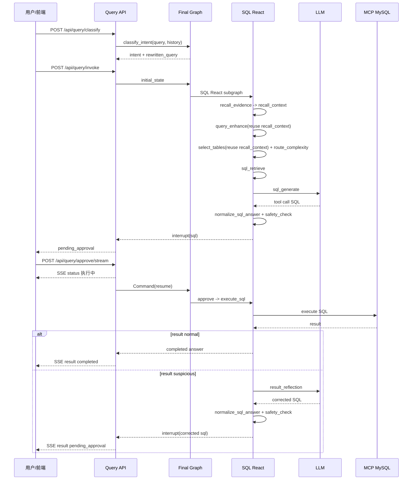

# Agent Platform Python 技术设计文档

本文档描述当前项目的最新实现，重点覆盖 NL2SQL Agent、RAG、LangGraph 编排、Human-in-the-Loop 审批、异常结果反思与 SSE 前端反馈。

相关文档：

- [README](README.md)
- [迭代优化记录](docs/iterations.md)
- [熔断降级与 Fallback 设计](docs/resilience_design.md)

## 1. 项目定位

项目是一个基于 **LangChain + LangGraph + FastAPI** 的财务 Copilot 平台，核心目标是把自然语言问题转成可信的结构化数据查询，并在执行前后加入安全、审批、修正和用户反馈。

当前主要能力：

| 能力 | 当前实现 |
|------|----------|
| NL2SQL | `Final Graph -> SQL React`，支持单次 evidence 召回复用、轻量表路由画像、复杂查询路由、SQL 生成、安全审查、人工审批、执行与反思 |
| RAG 问答 | Milvus 向量 + ES BM25 + RRF + Cross-Encoder rerank |
| 业务知识 | `t_business_knowledge` 存储术语、公式、同义词，支持 MySQL lexical fallback |
| 语义模型 | `t_semantic_model` 统一存储物理字段、业务名、同义词、描述、主外键信息 |
| 审批体验 | LangGraph interrupt 暂停，`/api/query/approve/stream` 用 SSE 展示执行和反思过程 |
| 记忆系统 | Session 历史、摘要、实体/事实/偏好 |
| 稳定性 | 超时、错误分类、可配置重试、SQL 格式化、LangGraph 状态 reducer |

## 2. 分层架构

```text
┌─────────────────────────────────────────────────┐
│ API 层 FastAPI                                   │
│ query / rag / document / admin / static          │
├─────────────────────────────────────────────────┤
│ Flow 编排层 LangGraph                            │
│ Final Graph / SQL React / RAG Chat / Analyst     │
├─────────────────────────────────────────────────┤
│ 能力层                                           │
│ Model Factory / RAG Retriever / Tool Registry    │
├─────────────────────────────────────────────────┤
│ 数据与基础设施层                                  │
│ MySQL / Redis Checkpoint / Milvus / ES / MCP      │
└─────────────────────────────────────────────────┘
```

关键目录：

| 路径 | 说明 |
|------|------|
| `agents/api/routers/query.py` | 查询入口、意图分类、invoke、approve、approve SSE |
| `agents/flow/dispatcher.py` | Final Graph，负责意图分类和子图分发 |
| `agents/flow/sql_react.py` | NL2SQL 主流程 |
| `agents/flow/state.py` | LangGraph 状态定义和 reducer |
| `agents/rag/retriever.py` | 混合检索、业务知识召回、语义模型加载 |
| `agents/rag/domain_summary_builder.py` | 基于 Redis/MySQL 语义模型生成领域摘要 |
| `agents/model/format_tool.py` | LLM 结构化输出工具和 SQL 格式化校验 |
| `agents/tool/sql_tools/` | MCP SQL 执行、安全检查、错误分类 |
| `agents/static/index.html` | Chat、SQL Agent、审批与 SSE 进度 UI |
| `scripts/seed_business_knowledge.py` | 业务知识种子数据 |

说明：`agents/rag/schema_indexer.py` 是旧版 `source=mysql_schema` 向量索引兼容入口，默认不在启动、seed 或 NL2SQL 主链路中执行。当前 schema 权威来源是 MySQL `t_semantic_model`，高频读取走 Redis 缓存。

## 3. API 调用设计

### 3.1 查询入口

| Endpoint | 用途 |
|----------|------|
| `POST /api/query/classify` | 只做意图分类和查询重写，返回 `intent + rewritten_query` |
| `POST /api/query/invoke` | 执行主图。若 SQL 需要审批，返回 `pending_approval=true` |
| `POST /api/query/approve` | 非流式审批恢复 |
| `POST /api/query/approve/stream` | 流式审批恢复，向前端推送执行和反思状态 |

`invoke` 初始状态：

```python
{
    "query": req.query,
    "session_id": req.session_id,
    "chat_history": chat_history,
    "intent": req.intent,                 # 可选，前端预分类时传入
    "rewritten_query": req.rewritten_query # 可选，前端预重写时传入
}
```

SQL 审批中断时，API 会把原始 query 暂存到 Session preference 的 `_pending_query`。approve 完成后恢复保存本轮 Q&A。

### 3.2 approve 恢复原则

当前 approve 只通过 `Command(resume=...)` 恢复 interrupt：

```python
Command(resume={
    "approved": req.approved,
    "feedback": req.feedback,
})
```

不再通过 `Command.update` 写回 `query`。原因是父图和 SQL 子图在恢复时可能同一步合并状态，重复写不可聚合字段会触发 LangGraph `INVALID_CONCURRENT_GRAPH_UPDATE`。

## 4. LangGraph 状态设计

### 4.1 FinalGraphState

`FinalGraphState` 负责主调度状态：

```python
class FinalGraphState(TypedDict):
    query: Annotated[str, latest_non_empty]
    session_id: str
    chat_history: list[dict]
    intent: str
    rewritten_query: Annotated[str, latest_non_empty]
    sql: str
    result: str
    answer: str
    status: str
```

### 4.2 SQLReactState

`SQLReactState` 负责 NL2SQL 子图状态：

```python
class SQLReactState(TypedDict):
    query: Annotated[str, latest_non_empty]
    rewritten_query: Annotated[str, latest_non_empty]
    enhanced_query: str
    evidence: list[str]
    few_shot_examples: list[str]
    recall_context: dict
    selected_tables: list[str]
    table_relationships: list[dict]
    route_mode: str
    route_signal: str
    complex_plan: dict
    docs: list[Document]
    semantic_model: dict
    sql: str
    is_sql: bool
    approved: bool
    refine_feedback: str
    result: str
    error: str | None
    retry_count: int
    execution_history: list[dict]
    reflection_notice: str
```

### 4.3 query / rewritten_query reducer

`query` 和 `rewritten_query` 是跨父图、SQL 子图、approve/resume 都会携带的稳定输入字段。为了同时支持“新一轮请求覆盖旧 checkpoint”和“approve/resume 不带新值时保留当前值”，二者使用同一个 reducer：

```python
def latest_non_empty(current: str | None, incoming: str | None) -> str:
    return incoming or current or ""
```

该 reducer 不承担查询增强职责。查询增强仍由 `enhanced_query` 表达，证据复用由 `recall_context.query_key` 做当前 query 校验。

## 5. Final Graph 设计

```text
START
  -> classify_intent
  -> route_intent
       -> sql_react
       -> chat_direct
  -> END
```

`classify_intent` 一次 LLM 调用同时完成两件事：

1. 根据数据库领域摘要和用户问题判断 intent。
2. 根据对话历史把省略/指代问题重写成独立问题。

当请求已传入 `intent + rewritten_query` 时，节点跳过 LLM，避免前后端重复分类。

当前路由策略：

| intent | 目标 |
|--------|------|
| `sql_query` | SQL React |
| 其他意图 | RAG Chat / chat_direct |

## 6. SQL React 设计

### 6.1 主流程

```text
recall_evidence
  -> query_enhance
  -> select_tables
  -> infer_route_signal
  -> route_complexity
  -> sql_retrieve
  -> check_docs
  -> sql_generate
  -> safety_check
  -> approve
  -> execute_sql
  -> END
```

异常分支：

```text
execute_sql -- retryable error --> error_analysis -> sql_generate
execute_sql -- suspicious result --> result_reflection -> safety_check -> approve -> execute_sql
route_complexity -- complex_plan --> complex_plan_generate -> approve_complex_plan -> execute_complex_plan_step
route_complexity -- clarify --> END
```

### 6.2 节点职责

| 节点 | 说明 |
|------|------|
| `recall_evidence` | 并行召回业务知识和 SQL few-shot 示例，并构建 `recall_context` |
| `query_enhance` | 基于 `recall_context.evidence` 翻译业务术语，LLM 空响应时使用 evidence 驱动 fallback |
| `select_tables` | 从 MySQL/Redis 加载表信息，构建轻量 table routing profile，让 LLM 精选相关表，并用 `recall_context` 和逻辑外键做本地重排/补表 |
| `infer_route_signal` | 从数据库规则或 LLM 获取复杂查询语义信号，例如 analysis/report/detail/export/sensitive |
| `route_complexity` | 根据表数、关系数和 route signal 决定 `single_sql`、`single_sql_with_strict_checks`、`complex_plan` 或 `clarify` |
| `sql_retrieve` | 根据表名加载完整语义模型并构建 schema docs |
| `check_docs` | 无 schema 时直接返回用户友好错误 |
| `sql_generate` | 用 LLM tool 生成 SQL，支持最多 3 轮自动补表 |
| `safety_check` | 只允许安全 SELECT/WITH 查询继续审批 |
| `approve` | LangGraph interrupt，等待用户确认 |
| `execute_sql` | 通过 MCP MySQL 执行 SQL |
| `error_analysis` | 对可重试执行错误生成修正反馈，再回到 `sql_generate` |
| `result_reflection` | 对空集、NULL 等异常成功结果直接生成修正 SQL |
| `complex_plan_generate` | 对超过单 SQL 预算且可拆分析的问题生成结构化计划 |
| `approve_complex_plan` | 在执行复杂计划前让用户确认步骤、依赖和合并键 |

### 6.3 recall_context 设计

`recall_evidence` 是 SQL 链路唯一的业务知识和 few-shot 检索节点。它返回原始 evidence 的同时，会把可复用信息整理为结构化上下文：

```python
{
    "query_key": "查询各个部门的年度预算总金额",
    "business_evidence": [...],
    "few_shot_examples": [...],
    "business_related_tables": ["t_cost_center"],
    "few_shot_related_tables": ["t_budget", "t_cost_center"],
    "matched_terms": ["年度预算", "部门"],
    "few_shot_questions": ["查询各部门年度预算总额"],
}
```

设计约束：

- 每轮 query 只调用一次 `recall_evidence`，后续节点只读 state，不再重复召回。
- `recall_context.query_key` 必须等于当前 `rewritten_query/query`，否则视为旧 checkpoint 污染并忽略。
- `business_related_tables` 只来自当前 query 命中 `term/synonyms` 的业务知识；召回到但未命中的业务知识只保留在原始 evidence 中，不参与选表合并。
- `few_shot_related_tables` 只来自与当前 query 有足够词面重叠的 few-shot 示例，避免相似度召回噪声把无关表带入关系查询。
- `select_tables` 使用 `business_related_tables`、`few_shot_related_tables`、`matched_terms` 和 `few_shot_questions` 做表合并、表重排和字段提示打分。
- `sql_generate` 仍使用原始 evidence/few-shot，保证 prompt 可读；`recall_context` 主要服务于链路可解释和选表稳定性。

这解决了原来 `_ranking_terms()` 只靠中文 n-gram 的问题：字面匹配仍作为 fallback，但优先使用业务知识和 few-shot 召回出来的语义证据。

### 6.4 query_enhance 设计

`query_enhance` 不做 query-specific 硬编码。它只使用召回到的业务知识：

```text
术语: 净利润
公式: 收入 - 成本 - 费用；亏损表示净利润 < 0
同义词: 净收益, 盈利, 亏损, 净亏损, 赔钱, 赚钱
```

增强策略：

1. 优先让 LLM 根据 evidence 输出增强后的 query。
2. 如果 LLM 返回空或失败，使用 `_heuristic_enhance_query()` 从 evidence 中解析 `术语/公式/同义词` 做确定性增强。
3. 如果没有 evidence，保持原 query，不臆造业务口径。

业务词新增方式是维护 `t_business_knowledge.term/synonyms/formula`，不是改代码。

### 6.5 select_tables 设计

`select_tables` 不把完整 schema 提前交给 LLM。它先读取表说明和当前 query 命中的少量字段提示，构建轻量 table routing profile：

```text
- t_budget: 预算管理表 | 匹配字段: budget_amount(预算金额/预算额度)；cost_center_id(成本中心ID/部门/-> t_cost_center.id)
- t_cost_center: 成本中心表 | 匹配字段: annual_budget(年度预算/全年预算)；department_id(关联部门ID/-> t_department.id)
```

随后执行三步治理：

1. 用 LLM 在候选表画像中精选表。
2. 合并 `recall_context` 中业务知识和 few-shot 指向的相关表。
3. 基于 `t_semantic_model.is_fk/ref_table/ref_column` 做链式逻辑外键补表和本地语义重排。

完整字段类型、完整字段列表和 JOIN 关系只在 `sql_retrieve -> sql_generate` 阶段按已选表加载，避免把 SQL 生成的 token 压力前移到选表阶段。

### 6.6 复杂查询路由

复杂度路由不在 Python 里硬编码业务关键词，只使用结构信号和外部语义信号：

```text
<= 5 张表：single_sql
6-8 张表：single_sql_with_strict_checks
> 8 张表：根据 route_signal 进入 complex_plan 或 clarify
```

`route_signal` 来自数据库规则或 LLM 仲裁。`analysis/report/comparison` 可进入 `complex_plan`，`detail/export/sensitive/ambiguous` 走 `clarify`。复杂计划必须通过 `validate_complex_plan()`，校验步骤数、表白名单、依赖关系、SQL 子任务表数和 `merge_keys`，再进入用户确认。

当前复杂计划链路已完成路由、计划生成、计划校验和审批占位。多 SQL 分步执行会复用现有 SQL 生成、安全检查和审批能力继续迭代。

### 6.7 SQL 输出格式化

LLM 通过 `sql_format_response` tool 返回：

```python
{
    "answer": "SELECT ...",
    "is_sql": True,
    "needs_more_tables": False,
    "missing_tables": []
}
```

本地 `normalize_sql_answer()` 会再次清洗和校验：

- 去除 `<text_never_used_...>` 这类异常 token。
- 去除 Markdown SQL fence。
- 截取解释文本后的 `SELECT/WITH`。
- 拦截尾部截断关键字，例如 `HAVIN`、`WHERE`、`AND`。
- 拦截括号不匹配。
- 拦截非 `SELECT/WITH` 开头的 SQL。
- 统一单个结尾分号。

`sql_generate` 和 `result_reflection` 都必须经过该格式化器，不能只依赖 LLM tool schema。

### 6.8 执行结果反思

SQL 执行成功不等于结果可信。`_result_anomaly_reason()` 会识别：

- 裸 `[]`
- `{"rows": []}`、`{"data": []}`、`{"result": []}`、`{"items": []}`
- `{"columns": [...], "rows": []}`
- `null` / `None`
- 结构化结果中所有字段均为 `NULL` 或空字符串
- 原始字符串中出现 `null` 或 `[]` 的可疑信号

命中异常且未超过 `max_sql_retries` 时进入：

```text
execute_sql -> result_reflection -> safety_check -> approve -> execute_sql
```

`result_reflection` 的职责是直接输出修正后的 SQL，不再把建议交回 `sql_generate` 二次生成。

## 7. Human-in-the-Loop 与 SSE

### 7.1 初次审批

`approve` 节点 interrupt payload：

```python
{
    "sql": state["sql"],
    "message": "请确认是否执行以上 SQL？",
    "reflection": False,
}
```

前端收到 `pending_approval=true` 后展示 SQL 审批卡片。

### 7.2 反思后审批

如果 SQL 是 `result_reflection` 生成的修正 SQL，payload 会包含：

```python
{
    "message": "上次执行结果疑似异常，系统已反思并生成修正后的 SQL。请确认是否执行修正后的 SQL？",
    "reflection": True,
}
```

### 7.3 SSE 进度

`/api/query/approve/stream` 会推送：

```text
status: 已确认，正在执行 SQL...
status: 如果执行结果异常，系统会自动反思并生成修正 SQL...
status: 检测到执行结果异常，已完成反思并生成修正 SQL。
status: 请确认是否执行修正后的 SQL。
result: QueryResponse JSON
done: [DONE]
```

这样用户能理解“为什么又需要确认一条 SQL”，不会误以为系统重复审批同一条 SQL。

## 8. RAG 设计

RAG 检索管线：

```text
Query
  -> Milvus vector search
  -> Elasticsearch BM25 search
  -> RRF fusion
  -> Cross-Encoder rerank
  -> Top-K docs
```

RAG Chat 流程：

```text
preprocess -> rewrite -> retrieve -> construct_messages -> chat -> END
```

支持传统 RAG 和 Parent Document RAG。查询重写使用 Session 历史和摘要做指代消解。

## 9. 业务知识与语义模型

### 9.1 t_business_knowledge

用于表达业务口径：

| 字段 | 作用 |
|------|------|
| `term` | 业务术语，例如净利润 |
| `definition/formula` | 定义和计算口径 |
| `synonyms` | 同义词和口语表达，例如亏损、净亏损 |
| `related_tables` | 相关表提示 |

召回顺序：

1. Milvus 向量召回。
2. ES BM25 召回。
3. RRF 融合和过滤。
4. MySQL `term/synonyms` lexical fallback，补齐口语化查询。

### 9.2 t_semantic_model

用于 NL2SQL schema 理解：

| 信息 | 用途 |
|------|------|
| 表名、表描述 | `select_tables` 候选表选择 |
| 字段名、类型、注释 | SQL 物理字段生成 |
| 业务名、同义词、描述 | 选表轻量字段提示 + SQL 生成业务含义理解 |
| PK/FK、逻辑外键 | 链式补表、桥接表发现、JOIN 关系提示 |

`sql_retrieve` 从该表构建 schema docs，不再依赖 Milvus schema 索引。

## 10. 稳定性设计

| 风险 | 当前处理 |
|------|----------|
| LLM 空响应 | query_enhance 使用 evidence fallback |
| SQL 格式异常 | `normalize_sql_answer()` 清洗和拦截 |
| SQL 危险操作 | `SQLSafetyChecker` 拦截 |
| SQL 执行失败 | `is_retryable()` 决定是否 `error_analysis -> sql_generate` |
| SQL 执行成功但结果异常 | `_result_anomaly_reason()` 触发 `result_reflection` |
| approve 后 query 丢失 | Session `_pending_query` 用于最终 Q&A 保存 |
| approve 后并发写 query | `query/rewritten_query: Annotated[..., latest_non_empty]` |
| checkpoint 中召回上下文污染 | `recall_context.query_key` 与当前 `rewritten_query/query` 不一致时忽略；部署结构变更后清理旧 checkpoint |
| 检索/LLM 慢或失败 | resilience 配置的 timeout 和 retry |

## 11. 时序图



## 12. 测试覆盖

当前关键测试：

| 文件 | 覆盖 |
|------|------|
| `tests/test_sql_react.py` | query_enhance、recall_context、轻量选表画像、链式补表、SQL 格式化、结果异常检测、result_reflection、图节点、query reducer |
| `tests/test_final_api.py` | query invoke、approve resume、approve SSE |
| `tests/test_rag_e2e.py` | RAG 端到端流程 |
| `tests/test_api.py` | API 基础行为 |

推荐变更后至少执行：

```bash
pytest tests/test_final_api.py tests/test_sql_react.py -q
```
